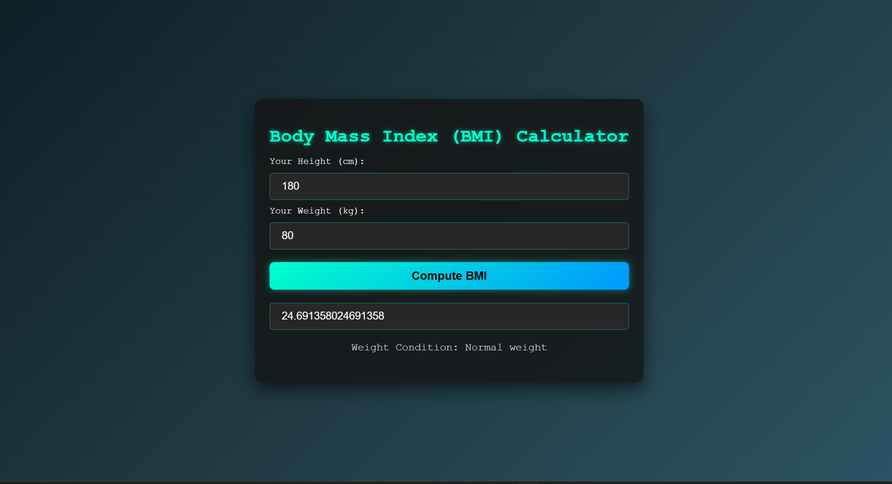

# BMI Calculator

A sleek and modern web-based Body Mass Index (BMI) calculator built with HTML, CSS, and JavaScript.

## Features

- Calculate BMI based on height and weight inputs
- Display BMI value and corresponding weight condition
- Responsive design with a dark, futuristic UI
- Real-time calculation upon button click

## Usage

1. Open `index.html` in your web browser.
2. Enter your height in centimeters.
3. Enter your weight in kilograms.
4. Click the "Compute BMI" button.
5. View your BMI value and weight condition.

## BMI Categories

- Underweight: BMI < 18.5
- Normal weight: 18.5 ≤ BMI ≤ 24.9
- Overweight: 25 ≤ BMI ≤ 29.9
- Obesity: BMI ≥ 30

## Technologies Used

- HTML5
- CSS3 (with gradients, shadows, and transitions)
- Vanilla JavaScript

## Screenshots

## Contributing

Feel free to fork this project and submit pull requests for improvements.

## License

This project is open source and available under the [MIT License](LICENSE).
